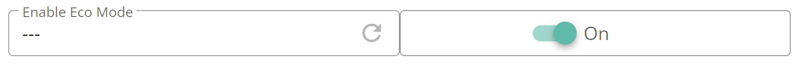
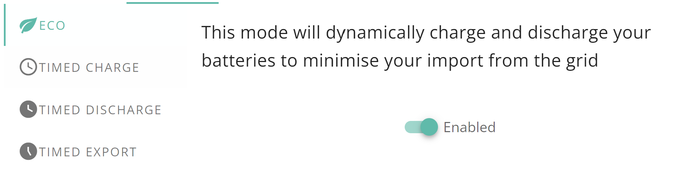

# Inverter & battery controls

Inverter controls are split in to:

* [Entities](#entities) that map to a single configurable setting on the inverter.
* [Services](#services) that map to multiple settings on the inverter. There are used to expose high-level functions in a single place.

## Entities

### Battery power limits

Use `number.battery_charge_power_limit` and `number.battery_discharge_power_limit` to set the power limit (in Watts) for charging and discharging, respectively.

It's perfectly valid to set the value to 0, which has the effect of pausing charging or discharging until a non-zero value is set.

### Battery AC charge limit

Use `number.battery_ac_charge_limit` to set the target battery percentage when charging from the grid.

### Battery Eco (a.k.a Dynamic) mode

Use `switch.battery_eco_mode` to change this value. This is not to be confused with "Eco" mode as you see in the GivEnergy app; use the [Activate eco mode](#activate-eco-mode) for that.

Here is the corresponding control in the GivEnergy portal:

Don't blame the integration for this confusion; unfortunately GivEnergy came up with this naming system.

* When `on`, the battery will only discharge to match demand. No energy will be exported.
* When `off`, the battery to discharge at maximum power.

### Battery AC charging

When `switch.battery_ac_charging` is turned `on`, the battery will be charged from the grid. This only happens during active charge slots.

### Battery DC discharging

`switch.battery_dc_discharging` is typically used in combination with other switches/modes. In general, it's believed that this should be `on` when you want to respect discharge slots.

This seems to work for "Timed Export" mode, however "Timed Discharge" does not appear to behave as expected, with the battery continuing to discharge outside of the defined slots. This was observed on a Gen1 inverter, so results on other equipment may vary. Please update this if you know more!

### Battery cutoff limit

`number.battery_cutoff_limit` sets the minimum allowable battery SOC during battery discharge.

This is relatively useful, unlike the poorly named and confusing...

### Battery SOC reserve

This is controlled via `number.battery_soc_reserve`. Despite the name, this does not set a minimum SOC under normal conditions.

This is poorly documented. A GivEnergy marketing document suggests that this only affects systems with an EPS configured.

To further add confusion, this setting is exposed in the GivEnergy app, rather than the more useful cutoff limit.

## Services

These operations map to high-level operations provided by GivEnergy (e.g. via the mobile app). Executing a service will changing several inverter settings in one go.

### Activate eco mode

This refers to the mode as you see in the GivEnergy app, and not `switch.battery_eco_mode`. Here is the corresponding control in the GivEnergy portal:

Activating this mode is equivalent to configuring the following individual options:
* Set `switch.battery_eco_mode` to `on`.
* Set `switch.battery_dc_discharging` to `off`.

### Activate timed discharge mode

This is supposed to discharge the battery for home consumption only during the specified time period.

Activating this mode is equivalent to configuring the following individual options:
* Set `switch.battery_eco_mode` to `on`.
* Set `switch.battery_dc_discharging` to `on`.
* Set the first battery discharge slot.

As noted in [battery DC discharging](#battery-dc-discharging), this does not appear to work.

### Activate timed export mode

This will discharge the battery and export to the grid during the specified time period.

Activating this mode is equivalent to configuring the following individual options:
* Set `switch.battery_eco_mode` to `off`.
* Set `switch.battery_dc_discharging` to `on`.
* Set the first battery discharge slot.

Ways to turn this off include:

* [Activate eco mode](#activate-eco-mode)
* Set `switch.battery_dc_discharging` to `off`.

### Enable timed charging

The battery will charge from the grid during the defined time period, up to the SOC as given.

Activating this mode is equivalent to configuring the following individual options:
* Set `switch.battery_ac_charging` to `on`.
* Set `number.battery_ac_charge_limit`.
* Set the first battery charge slot.

Ways to turn this off include:

* [Activate eco mode](#activate-eco-mode)
* Set `switch.battery_dc_discharging` to `off`.

### Disable timed charging

This simply sets `switch.battery_ac_charging` to `off`. It may be removed in a future version.
