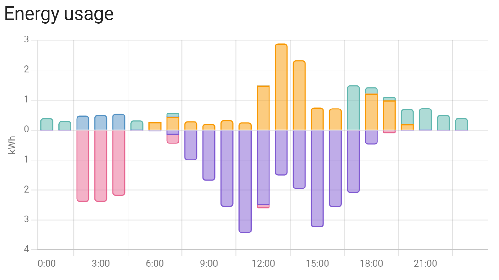

# Energy dashboard

The entities provided by this integration can be used directly in the Home Assistant energy dashboard.

If you have only just installed the integration, the required sensors might take a short while to appear selectable in the energy dashboard configuration page.

* Under **Electricity grid**, select the **Grid Import Today** and **Grid Export Today** entities.
* Under **Solar Panels**, select the **PV Energy Today** sensor.
* Under **Home Battery Storage**, select the **Battery Discharge Today** and **Battery Charge Today** sensors.

